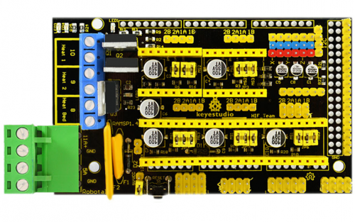
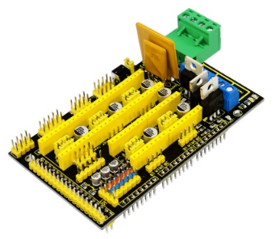
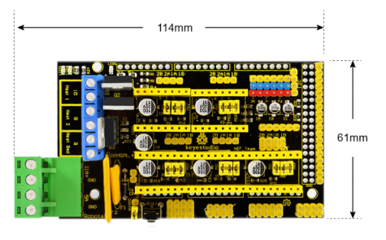

# KS0154 keyestudio Mega Pololu Shield (RAMPS 1.4 )

## 1. Introduction

keyestudio RAMPS1.4A is used as driving shield for 3D printers, fully compatible with MEGA2560 control board and official RAMPS 1.4 .

It has total 5 slots for stepper motor drive module to drive 5-channel stepper motors. The slots are compatible with all kinds of drive modules like A4988, DEV8825.

There are 3 jumper caps under each slot, which can be used to control the working subdivision of drive modules.

For example, if connect the A4988 and plug three jumpers, the subdivision port MS1、MS2 and MS3 of A4988 module are at active HIGH, so the A4988 module is in 16-subdivision working mode. But if unplug the three jumpers, MS1、MS2 and MS3 of A4988 module are at active LOW, so the A4988 module is in full-step working mode.

Furthermore, it is easy to stack it onto the MEGA 2560 control board, after burning the program, you can combine it with external devices to make your own 3D printer.

## 2. Check out these awesome features

- MEGA 2560 control board compatible
- Supports the software Repetier-Host
- Can drive 5 stepper motors
- Control the drive module via jumper cap. (Note: If connect the A4988, unplug three jumpers, in full-step mode; if plug the jumpers, in 16-subdivision working mode.)
- Comes with 4pin headers of 2.54mm pitch for 42 step motor connection.
- Supply the voltage DC 12V for 3D printer.
- Onboard comes with 4 LEDs, separately are 2 Heat LEDs, a Heat Bed LED and a D13 LED.
- Comes with 2 Heat interfaces (D10, D9 control) and a Heat Bed interface(D8 control)
- Onboard comes with a reset button
- Comes with other interfaces for 3D Printer, such as LCD connection pins ( need to connect the pinboard), limit switch pins, cooling fan interface.

## 3. Technical Details

- Dimensions: 114mm x 61mm x 32mm
- Weight: 67.5g

## 4. PINOUT Instruction

## 5. Using Method

When using this shield, on the hardware, you need to use it with the control board (MEGA2560 board), the drive board (such as A4988), the motor (42 stepper motor) and others. And you need to burn the firmware to the control board. So need to use the software Arduino IDE, and the special upper computer software, such as Repetier-Host software.

For detailed use, refer to our keyestudio 3D Printer Kit on wiki website.